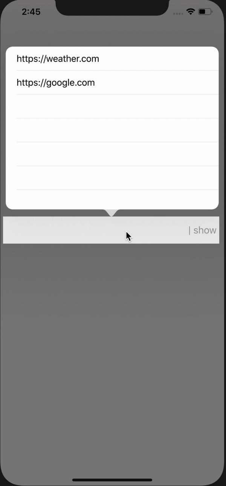

# PKAutofillTextField

[](https://travis-ci.org/pvn/PKAutofillTextField)
[](https://cocoapods.org/pods/PKAutofillTextField)
[](https://cocoapods.org/pods/PKAutofillTextField)
[](https://cocoapods.org/pods/PKAutofillTextField)

**Feature:**
* Ease to integrate by just creating instance and add to view
* Holds all inputs w.r.t. their unique identifier
* Store default values without giving input manually, just set those values while intializing
* Ability to delete records



## Installation

### CocoaPods
PKAutofillTextField is available through [CocoaPods](https://cocoapods.org). To install
it, simply add the following line to your Podfile:

```ruby
pod 'PKAutofillTextField'
```

### Manual
Copy the entire `PKSecurePin` folder which contains two swift files and add to your project
```
cp -rf PKAutofillTextField/Classes/ <to_your_project_dir>
```

## Usage
```swift

		// import the PKAutofillTextField
		import PKAutofillTextField

		class ViewController: UIViewController, PKAutofillTextFieldDelegate {

			override func viewDidLoad() {
        		// instantiate PKAutofillTextField
        		// presenting: self
        		// keyIdentifier: unique identifier for textfield
        		// buttonTitle: to show the button title on textfield
        
        		let textField = PKAutofillTextField.init(frame: CGRect.init(x: 5, y: 400, width: 400, height: 50), presenting: self, keyIdentifier: "server", delegate: self, buttonTitle: "show")
        
        		// some default values for textfield
        		textField.defaultValues(values: ["https://google.com", "https://weather.com"])
        
        		// add textfield to view
        		self.view.addSubview(textField)
    		}

    		// callback methods of PKAutofillTextFieldDelegate
    		func selectedValue(value: String) {
        		//implementation goes here after selecting the value from lists
    		}
    	}
```

## Example

To run the example project, clone the repo, and run `pod install` from the Example directory first.

## Author

Praveen Kumar Shrivastav, composetopraveen@gmail.com

## License

PKAutofillTextField is available under the MIT license. See the LICENSE file for more info.
